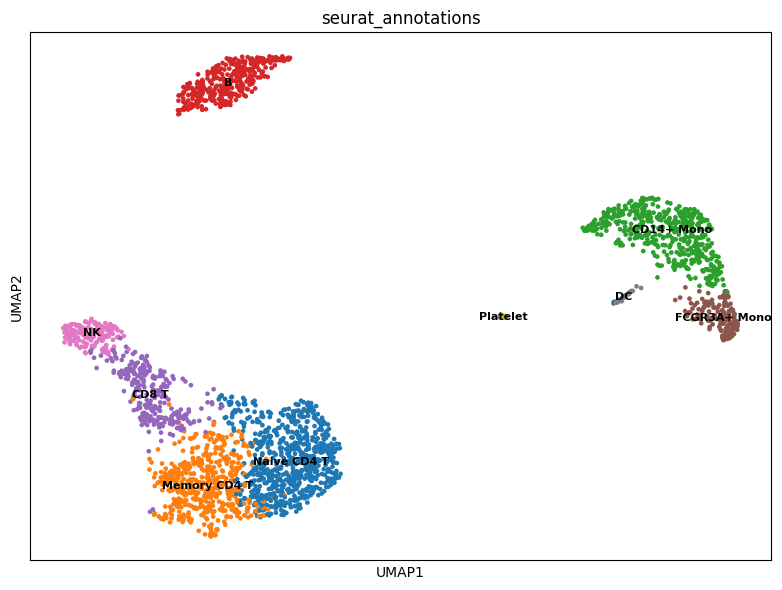

# Conversions: h5Seurat and AnnData

This vignette showcases how to convert between `Seurat` objects and
AnnData files via h5Seurat files. This allows interoperability between
Seurat and [Scanpy](https://scanpy.readthedocs.io/).

``` r

library(Seurat)
library(srtdisk)
```

## Converting from Seurat to AnnData via h5Seurat

To demonstrate conversion from a `Seurat` object to an AnnData file,
we’ll use the `pbmc3k.final` dataset from SeuratData - a processed PBMC
dataset with clustering and UMAP.

``` r

library(SeuratData)

# Install pbmc3k if not already installed
if (!"pbmc3k.final" %in% rownames(InstalledData())) {
  InstallData("pbmc3k")
}

# Load the processed pbmc3k dataset
data("pbmc3k.final", package = "pbmc3k.SeuratData")
pbmc <- UpdateSeuratObject(pbmc3k.final)
pbmc
#> An object of class Seurat 
#> 13714 features across 2638 samples within 1 assay 
#> Active assay: RNA (13714 features, 2000 variable features)
#>  3 layers present: counts, data, scale.data
#>  2 dimensional reductions calculated: pca, umap
```

This is a fully processed Seurat object with clustering and dimensional
reductions:

``` r

DimPlot(pbmc, reduction = "umap", label = TRUE, pt.size = 0.5) + NoLegend()
```


Converting the `Seurat` object to an AnnData file is a two-step process:

1.  Save the `Seurat` object as an h5Seurat file using
    [`SaveH5Seurat()`](https://mianaz.github.io/srtdisk/reference/SaveH5Seurat.md)
2.  Convert to AnnData using
    [`Convert()`](https://mianaz.github.io/srtdisk/reference/Convert.md)

``` r

SaveH5Seurat(pbmc, filename = "pbmc3k.h5Seurat", overwrite = TRUE)
Convert("pbmc3k.h5Seurat", dest = "h5ad", overwrite = TRUE)
```

We can view the AnnData file in Scanpy:

``` python
import scanpy as sc
adata = sc.read_h5ad("pbmc3k.h5ad")
print(adata)
#> AnnData object with n_obs × n_vars = 2638 × 13714
#>     obs: 'orig.ident', 'nCount_RNA', 'nFeature_RNA', 'seurat_annotations', 'percent.mt', 'RNA_snn_res.0.5', 'seurat_clusters'
#>     var: 'vst.mean', 'vst.variance', 'vst.variance.expected', 'vst.variance.standardized', 'vst.variable'
#>     uns: 'n_variable_features', 'neighbors', 'seurat'
#>     obsm: 'X_pca', 'X_umap'
#>     varm: 'PCs'
#>     obsp: 'connectivities', 'distances'
```

And visualize with cluster annotations:

``` python
import matplotlib
matplotlib.use('Agg')
import matplotlib.pyplot as plt

sc.pl.umap(adata, color='seurat_annotations', legend_loc='on data', legend_fontsize=8, show=False)
plt.tight_layout()
plt.savefig('umap_plot.png', dpi=100, bbox_inches='tight')
plt.close()
```



## Converting from AnnData to Seurat via h5Seurat

To demonstrate conversion from AnnData to Seurat, we’ll use a colorectal
cancer sample from [CellxGene](https://cellxgene.cziscience.com) that’s
bundled with the package.

``` r

# Copy bundled CRC h5ad file to working directory
h5ad_path <- system.file("testdata", "crc_sample.h5ad", package = "srtdisk")
if (file.exists(h5ad_path)) {
  file.copy(h5ad_path, "crc_sample.h5ad", overwrite = TRUE)
} else {
  # Download if not bundled (for development)
  download.file(
    "https://datasets.cellxgene.cziscience.com/91cf9a95-0b9a-4ece-b8eb-7b9e3409a0d3.h5ad",
    "crc_sample.h5ad",
    mode = "wb"
  )
}
#> [1] TRUE
```

View the h5ad file in Scanpy:

``` python
import scanpy as sc
adata_crc = sc.read_h5ad("crc_sample.h5ad")
print(adata_crc)
#> AnnData object with n_obs × n_vars = 935 × 25344
#>     obs: 'total_counts', 'log1p_total_counts', 'Sample ID', 'PhenoGraph_clusters', 'Patient', 'Primary Site', 'Sample Type', 'Site', 'DC 1', 'DC 2', 'DC 3', 'DC 4', 'Module Absorptive Intestine Score', 'Module EMT Score', 'Module Injury Repair Score', 'Module Squamous Score', 'Module Neuroendocrine Score', 'Module Endoderm Development Score', 'Module Tumor ISC-like Score', 'Module Secretory Intestine Score', 'Module Intestine Score', 'palantir_pseudotime', 'palantir_neuroendocrine_branch_probability', 'palantir_squamous_branch_probability', 'Fetal, Conserved', 'Module Osteoblast Score', 'Treatment', 'donor_id', 'development_stage_ontology_term_id', 'sex_ontology_term_id', 'self_reported_ethnicity_ontology_term_id', 'disease_ontology_term_id', 'tissue_type', 'tissue_ontology_term_id', 'cell_type_ontology_term_id', 'assay_ontology_term_id', 'suspension_type', 'Tumor Status', 'is_primary_data', 'cell_type', 'assay', 'disease', 'sex', 'tissue', 'self_reported_ethnicity', 'development_stage', 'observation_joinid'
#>     var: 'total_counts', 'highly_variable', 'gene', 'feature_is_filtered', 'feature_name', 'feature_reference', 'feature_biotype', 'feature_length', 'feature_type'
#>     uns: 'citation', 'default_embedding', 'neighbors', 'organism', 'organism_ontology_term_id', 'schema_reference', 'schema_version', 'title'
#>     obsm: 'X_umap'
print("\nobs columns:", list(adata_crc.obs.columns)[:10])
#> 
#> obs columns: ['total_counts', 'log1p_total_counts', 'Sample ID', 'PhenoGraph_clusters', 'Patient', 'Primary Site', 'Sample Type', 'Site', 'DC 1', 'DC 2']
```

Convert to Seurat:

``` r

Convert("crc_sample.h5ad", dest = "h5seurat", overwrite = TRUE)
crc <- LoadH5Seurat("crc_sample.h5seurat")
crc
#> An object of class Seurat 
#> 25344 features across 935 samples within 1 assay 
#> Active assay: RNA (25344 features, 0 variable features)
#>  1 layer present: counts
#>  1 dimensional reduction calculated: umap
```

``` r

# Plot UMAP if available
if ("umap" %in% Reductions(crc)) {
  DimPlot(crc, reduction = "umap", pt.size = 0.5)
}
```


## Visium Spatial Data Conversion

For spatial transcriptomics data, we use the stxBrain dataset from
SeuratData (Visium v2 format):

``` r

library(SeuratData)

# Install stxBrain if not already installed
if (!"stxBrain" %in% rownames(InstalledData())) {
  InstallData("stxBrain")
}

# Load anterior1 section
brain <- UpdateSeuratObject(LoadData("stxBrain", type = "anterior1"))
brain <- NormalizeData(brain)
SpatialFeaturePlot(brain, features = "Hpca")
```


Convert to h5ad:

``` r

SaveH5Seurat(brain, filename = "stxBrain.h5Seurat", overwrite = TRUE)
Convert("stxBrain.h5Seurat", dest = "h5ad", overwrite = TRUE)
```

View in Python with Squidpy:

``` python
import squidpy as sq
import scanpy as sc
import matplotlib
matplotlib.use('Agg')
import matplotlib.pyplot as plt

adata_spatial = sc.read_h5ad("stxBrain.h5ad")
fig, ax = plt.subplots(figsize=(10, 8))
sq.pl.spatial_scatter(
    adata_spatial,
    color="Hpca",
    library_id="anterior1",
    img_res_key="lowres",
    size=1.5,
    ax=ax
)
plt.savefig('stxBrain_plot.png', dpi=100, bbox_inches='tight')
plt.close()
```


## Python Environment Setup

For optimal interoperability, we recommend using a conda environment
with scanpy:

``` r

library(reticulate)

# Use existing scverse environment
use_condaenv("scverse", required = FALSE)

# Or create a new environment
# reticulate::conda_create("scverse")
# reticulate::conda_install("scverse", c("scanpy", "squidpy", "anndata"))

# Verify configuration
py_config()
```

``` r

sc <- reticulate::import("scanpy")
cat("Scanpy version:", sc$`__version__`, "\n")
#> Scanpy version: 1.11.3
```

## Metadata Preservation

srtdisk preserves cell metadata during conversion:

- **Categorical data**: Cell types, clusters, batch labels
- **Numerical data**: QC metrics like nCount_RNA, percent.mt
- **Factor ordering**: Level order for visualization

### Cluster Column Mapping

| Seurat            | AnnData/scanpy        |
|-------------------|-----------------------|
| `seurat_clusters` | `leiden` or `louvain` |
| `orig.ident`      | `batch`               |
| `nCount_RNA`      | `n_counts`            |
| `nFeature_RNA`    | `n_genes`             |

## Session Info

``` r

sessionInfo()
#> R version 4.5.2 (2025-10-31)
#> Platform: aarch64-apple-darwin20
#> Running under: macOS Tahoe 26.2
#> 
#> Matrix products: default
#> BLAS:   /System/Library/Frameworks/Accelerate.framework/Versions/A/Frameworks/vecLib.framework/Versions/A/libBLAS.dylib 
#> LAPACK: /Library/Frameworks/R.framework/Versions/4.5-arm64/Resources/lib/libRlapack.dylib;  LAPACK version 3.12.1
#> 
#> locale:
#> [1] en_US.UTF-8/en_US.UTF-8/en_US.UTF-8/C/en_US.UTF-8/en_US.UTF-8
#> 
#> time zone: America/Indiana/Indianapolis
#> tzcode source: internal
#> 
#> attached base packages:
#> [1] stats     graphics  grDevices utils     datasets  methods   base     
#> 
#> other attached packages:
#>  [1] stxKidney.SeuratData_0.1.0    stxBrain.SeuratData_0.1.2    
#>  [3] ssHippo.SeuratData_3.1.4      pbmcref.SeuratData_1.0.0     
#>  [5] pbmcMultiome.SeuratData_0.1.4 pbmc3k.SeuratData_3.1.4      
#>  [7] panc8.SeuratData_3.0.2        cbmc.SeuratData_3.1.4        
#>  [9] SeuratData_0.2.2.9002         srtdisk_0.1.0                
#> [11] Seurat_5.4.0                  SeuratObject_5.3.0           
#> [13] sp_2.2-0                      reticulate_1.44.1            
#> 
#> loaded via a namespace (and not attached):
#>   [1] RColorBrewer_1.1-3     jsonlite_2.0.0         magrittr_2.0.4        
#>   [4] spatstat.utils_3.2-1   farver_2.1.2           rmarkdown_2.30        
#>   [7] fs_1.6.6               ragg_1.5.0             vctrs_0.7.0           
#>  [10] ROCR_1.0-11            spatstat.explore_3.6-0 htmltools_0.5.9       
#>  [13] sass_0.4.10            sctransform_0.4.3      parallelly_1.46.1     
#>  [16] KernSmooth_2.23-26     bslib_0.9.0            htmlwidgets_1.6.4     
#>  [19] desc_1.4.3             ica_1.0-3              plyr_1.8.9            
#>  [22] plotly_4.11.0          zoo_1.8-15             cachem_1.1.0          
#>  [25] igraph_2.2.1           mime_0.13              lifecycle_1.0.5       
#>  [28] pkgconfig_2.0.3        Matrix_1.7-4           R6_2.6.1              
#>  [31] fastmap_1.2.0          fitdistrplus_1.2-4     future_1.69.0         
#>  [34] shiny_1.12.1           digest_0.6.39          patchwork_1.3.2       
#>  [37] tensor_1.5.1           RSpectra_0.16-2        irlba_2.3.5.1         
#>  [40] textshaping_1.0.4      labeling_0.4.3         progressr_0.18.0      
#>  [43] spatstat.sparse_3.1-0  httr_1.4.7             polyclip_1.10-7       
#>  [46] abind_1.4-8            compiler_4.5.2         bit64_4.6.0-1         
#>  [49] withr_3.0.2            S7_0.2.1               fastDummies_1.7.5     
#>  [52] MASS_7.3-65            rappdirs_0.3.4         tools_4.5.2           
#>  [55] lmtest_0.9-40          otel_0.2.0             httpuv_1.6.16         
#>  [58] future.apply_1.20.1    goftest_1.2-3          glue_1.8.0            
#>  [61] nlme_3.1-168           promises_1.5.0         grid_4.5.2            
#>  [64] Rtsne_0.17             cluster_2.1.8.1        reshape2_1.4.5        
#>  [67] generics_0.1.4         hdf5r_1.3.12           gtable_0.3.6          
#>  [70] spatstat.data_3.1-9    tidyr_1.3.2            data.table_1.18.0     
#>  [73] spatstat.geom_3.7-0    RcppAnnoy_0.0.23       ggrepel_0.9.6         
#>  [76] RANN_2.6.2             pillar_1.11.1          stringr_1.6.0         
#>  [79] spam_2.11-3            RcppHNSW_0.6.0         later_1.4.5           
#>  [82] splines_4.5.2          dplyr_1.1.4            lattice_0.22-7        
#>  [85] survival_3.8-6         bit_4.6.0              deldir_2.0-4          
#>  [88] tidyselect_1.2.1       miniUI_0.1.2           pbapply_1.7-4         
#>  [91] knitr_1.51             gridExtra_2.3          scattermore_1.2       
#>  [94] xfun_0.56              matrixStats_1.5.0      stringi_1.8.7         
#>  [97] lazyeval_0.2.2         yaml_2.3.12            evaluate_1.0.5        
#> [100] codetools_0.2-20       tibble_3.3.1           cli_3.6.5             
#> [103] uwot_0.2.4             xtable_1.8-4           systemfonts_1.3.1     
#> [106] jquerylib_0.1.4        dichromat_2.0-0.1      Rcpp_1.1.1            
#> [109] globals_0.18.0         spatstat.random_3.4-4  png_0.1-8             
#> [112] spatstat.univar_3.1-6  parallel_4.5.2         pkgdown_2.2.0         
#> [115] ggplot2_4.0.1          dotCall64_1.2          listenv_0.10.0        
#> [118] viridisLite_0.4.2      scales_1.4.0           ggridges_0.5.7        
#> [121] purrr_1.2.1            crayon_1.5.3           rlang_1.1.7           
#> [124] cowplot_1.2.0
```
